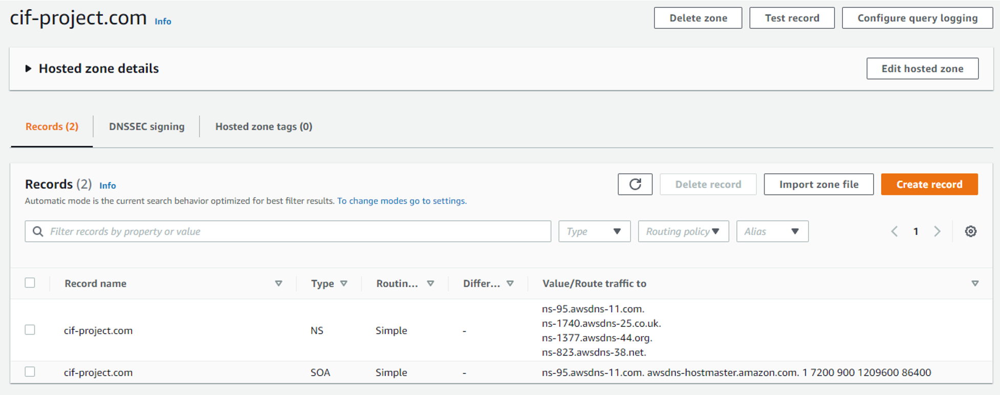
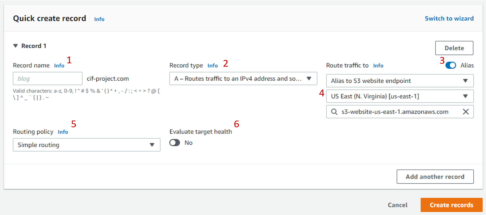
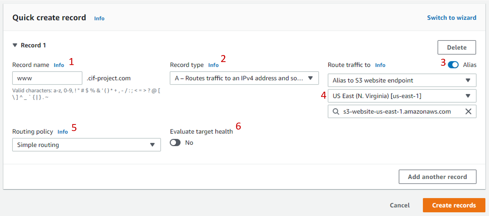

## Link the domain to S3 Buckets with Route 53

First, go to Route 53 and look for the DNS records of your hosted zone:

Now, let's analyze the situation: if a user tries to access your website through the main and redirect web addresses, he wil have no access: `This site can't be reached`.

And what you want is to:
- Forward the traffic received on the main web address to the main S3 Bucket;
- Forward the traffic received on the redirect web address to the redirect S3 Bucket.

To do so, you're going to create new DNS records in your hosted zone, and not just any DNS records: more precisely A records (A for Address), which allows you to redirect the traffic received to an IPv4 address. In this case, you won't need to specify any IPv4 address, AWS will provide the IP address of the Bucket for you.

##### Let's start with the first DNS record
You want to route traffic from your main web address (in this example *cif-project.com*):

1.	If your main address is www, then add *www* to the record name. If your main address is non-www, leave the record name as it is;

2.	Select the Record type A to route the traffic to the main S3 Bucket;

3.	Activate the Alias to specify the S3 Bucket to which you want to route the traffic;

4.	Choose an Alias to S3 website endpoint in the region where the Bucket is located (here *us-east-1*), and select the Bucket that is automatically displayed in the selection;

5.	Routing policy will be simple routing;

6.	No need to evaluate the target health since the website is hosted on S3.

Once the first record is created, wait several minutes before checking if your website is accessible via the main web address:

Finally! The website is now accessible through this URL, the first record works perfectly.

##### The second DNS record is next
You want to route the traffic of your redirect web address (in this example *www<nolink>.cif-project.com*).

1.	If your redirect address is www, then add www to the record name. If your redirect address is non-www, leave the record name as it is;

2.	Select again a Record type in A to route the traffic to the redirect S3 Bucket;

3.	Activate the Alias to specify the S3 Bucket to which you want to route the traffic;

4.	Choose an Alias to S3 website endpoint in the region where the Bucket is located (here *us-east-1*), and select the Bucket that is automatically displayed in the selection;

5.	Routing policy will be simple routing;

6.	No need to evaluate the target health since the site is hosted on S3.

Once the second record is created, wait again for several minutes before checking if your website is accessible via the web redirect address:

When accessing the redirect web address, you are redirected to the main web address: everything goes as planned...

...well, almost, in fact you have one more problem to solve. Can't you see where the problem is? It's right there:

Ouch, the website is not secure... it's understandable, the domain is brand new; you still haven't generated an SSL certificate, so the website uses HTTP instead of HTTPS.

To remedy these two problems in a simple way:
- First, create an SSL certificate for your domain by using AWS Certificate Manager (ACM);
- Then, use CloudFront to make your site issue HTTPS connections, adding the newly created SSL certificate to your website, and redirecting all HTTP traffic to HTTPS.

After that, your website will be safe and more secure for future users.

It is now time for you to create your first SSL certificate with AWS Certificate Manager.

### [Create a SSL certificate with AWS Certificate Manager](/projects/project-1/part-6/README.md)