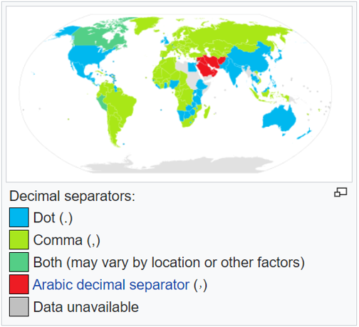
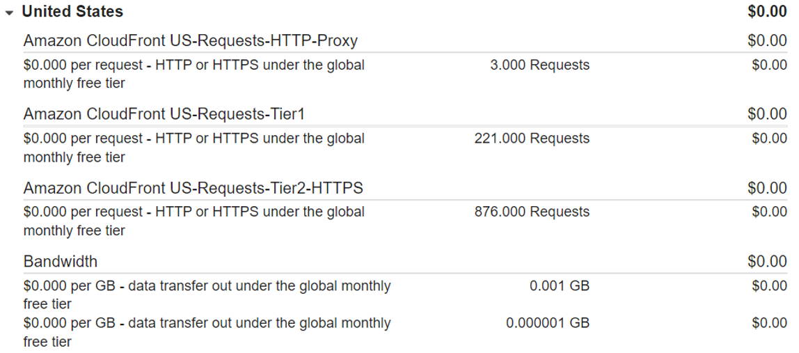
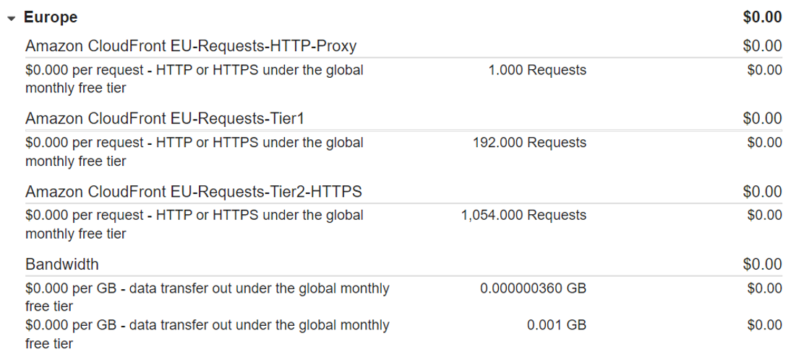
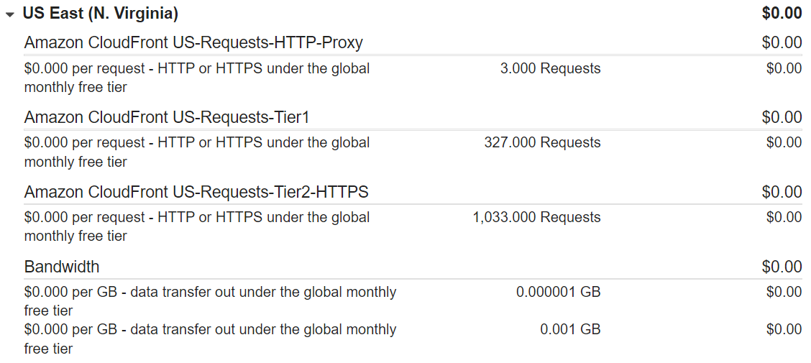
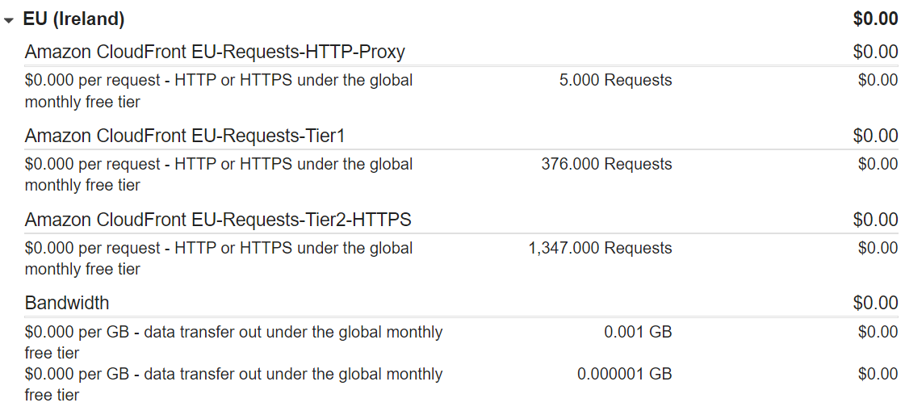

## And the bill ?

For the more hesitant who do not want to follow this tutorial blindly and wish to verify that this project will not cost them more than the advertised price: you are right to ask!

So I'm showing you, in my use case, my AWS bill over a week and a month of going live.
But before, let's look at this:

Here is a sample of my bill, we are interested in the number of requests here, and I have a question for you:
##### What value are you reading?
- A.	1012 Requests
- B.	1 012 000 Requests
- C.	1,012 Requests

The correct answer is A. If you chose answer B, you have probably seen two commas or two dots, and if you chose answer C, you are not totally wrong. In fact, it all depends on your decimal separator.

### A.	Decimal Separator
A little general knowledge doesn't hurt:

In the world, there are several types of notations to separate the integer part from the decimal part: the dot, the comma and the momayyez (also called the Arabic decimal separator).
The graph below shows the decimal separator according to the country:

Link: https://en.wikipedia.org/wiki/Decimal_separator

But what’s the problem?

Using the example above, with a number of 1,012.000 queries, it can be read differently by an American and a French person:
- The American reads "one thousand twelve";
- The French reads " one point zero twelve ";
- And whoever thought he saw two commas or two periods read "one million twelve thousand".

It ends up with totally different values, you can easily go from one to a million on a reading error.

##### As AWS is an American company, the decimal separator is the American one.

This means:
- The comma **,** is used to space out the thousands, e.g.: one billion = 1,000,000,000
- The dot **.** separates the integer part from the decimal part, ex: ½ = 0.5

You now know how to read an AWS invoice without any problem.
You can finally analyze the evolution of a bill from this project over a week and a month.

### B.	One week invoice

#### S3:
S3 Buckets are created in us-east-1, so we refer to the billing for that region only.

**What is observed:**
- Requests (Free Tier: 2,000 PUT & 20,000 GET):
    - 142 PUT, COPY, POST or LIST requests used = 7.1% of the Free Tier used;
    - 2,403 GET requests used = 12% of the Free Tier used.
- Storage (Free Tier: 5 GB):
    - 0.000000100 GB used = 0.000002% of the Free Tier used.

#### CloudFront:
Remember, for the *cif-project.com* website, the Price Class 100 was chosen; therefore, invoices will be generated only for North America and Europe.

**What is observed:**
- Requests (Free Tier: 2,000,000 HTTPS or HTTPS Requests):
    - 3 + 221 + 876 = 1,100 requests used = 0.055% of the Free Tier used.
- Storage (Free Tier: 50 GB):
    - 0.001 + 0.000001 = 0.001001 GB used = 0.002% of the Free Tier used.

**What is observed:**
- Requests (Free Tier: 2,000,000 HTTPS or HTTPS Requests):
    - 1 + 192 + 1,054 = 1,247 requests used = 0.062% of the Free Tier used.
- Storage (Free Tier: 50 GB):
    - 0.001 + 0.00000036 = 0.00100036 GB used = 0.002% of the Free Tier used.

#### Route 53:

**What is observed:**
- Queries (not free):
    - 2,283 queries = $0.0009132;
    - Queries to Alias records are free of charge.
- Hosted Zone (not free):
    - $0.50 per month.

#### AWS Certificate Manager:
No invoice since the creation of our SSL certificate is totally free.

___

In the end, except for the $0.50 of the hosted zone, we are well on our way to paying nothing: all services have a usage lower than 20% of the Free Tier in one week, so we will never exceed the Free Tier threshold at the end of the month.

But for the more skeptical, let's take a look at one month of the project's production.

### C.	One month invoice

>The following invoice is based on a two week deployment (exactly fifteen days). In the near future, a one month deployment invoice will be published instead of this one. For the time being, in order to simulate a one month invoice, the Free Tier usage should not exceed 50%.

#### S3:
S3 Buckets are created in us-east-1, so we refer to the billing for that region only.

**What is observed:**
- Requests (Free Tier: 2,000 PUT & 20,000 GET):
    - 173 PUT, COPY, POST or LIST requests used = 8.65% of the Free Tier used;
    - 3,594 GET requests used = 17.97% of the Free Tier used.
- Storage (Free Tier: 5 GB):
    - 0.000000300 GB used = 0.000006% of the Free Tier used.

#### CloudFront:
Remember, for the *cif-project.com* website, the Price Class 100 was chosen; therefore, invoices will be generated only for North America and Europe.

**What is observed:**
- Requests (Free Tier: 2,000,000 HTTPS or HTTPS Requests):
    - 5 + 443 + 1,629 = 2,077 requests used = 0.10% of the Free Tier used.
- Storage (Free Tier: 50 GB):
    - 0.001 + 0.000001 = 0.001001 GB used = 0.002% of the Free Tier used.

**What is observed:**
- Requests (Free Tier: 2,000,000 HTTPS or HTTPS Requests):
    - 2 + 407 + 1689 = 2,098 requests used = 0.1049% of the Free Tier used.
- Storage (Free Tier: 50 GB):
    - 0.002 + 0.000001 = 0.002001 GB used = 0.002% of the Free Tier used.

#### Route 53:

**What is observed:**
- Queries (not free):
    - 3,761 queries = $0.0015044;
    - Queries to Alias records are free of charge.
- Hosted Zone (not free):
    - $0.50 per month.

#### AWS Certificate Manager:
No invoice since the creation of our SSL certificate is totally free.

___

The Free Tier was used at a maximum of 17.97% in fifteen days, we are far below the 50% mark.

#### In one month, the Free Tier threshold will never be exceeded. We can conclude that the project is clearly feasible with an annual budget of less than $20.

### [Back to homepage]()